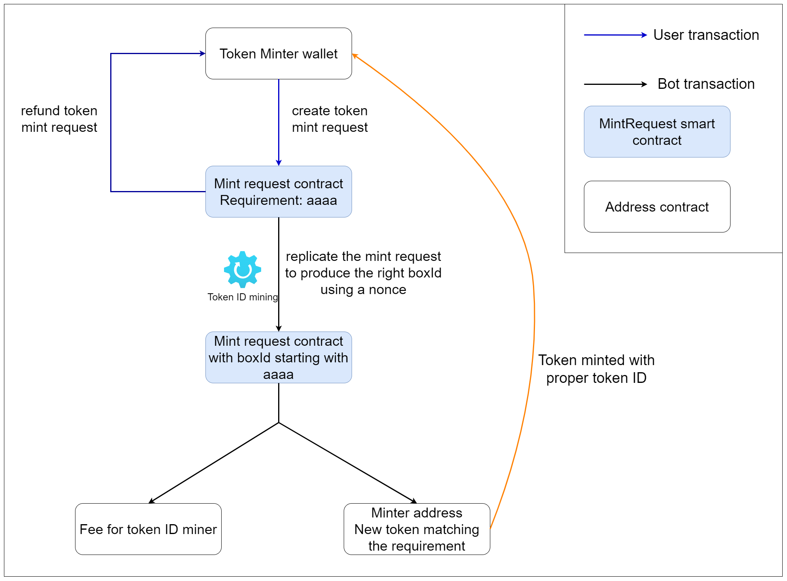

# CYTI - Choose Your Token ID

The project was made in the context of the Ergohack V.

The goal is to provide a decentralized service allowing token minter choose a specific pattern for the beginning of the token ID.
This can be convenient and add some values to the tokens.

The pattern requested needs to include an even number of hexadecimal characters ([0-9a-f]).
The difficulty increase exponentially with the length of the pattern requested.

On the other side, token ID miners can run the mining software to collect fees and compute the right hash.
They can setup a minimal price for the mining for each length.

Given the performance of the provided miner the possible length are limited to: 2, 4, 6, 8
A rough estimate of the mining difficulty depending on the length:

Possible length, difficulty and with 2800 H/s:
- 2 - Extremly easy (0.1s)
- 4 - Easy (25s)
- 6 - Hard (1h30mn)
- 8 - Extremly hard (17 days)

The CYTI contract is open to anyone without developper fee.
More performant token miner could be implemented to reduce the computation time and increase the possible choice for the length of the patterns.

# Contract overview
The token minter create a CYTI contract that includes:
- the description of the token he wants to mint
- its address (to sent the tokens)
- a pattern for the start of the token ID (for example "aaaa" in the following diagram)
- an amount a of ERG to process the mining transactions and pay a fee to the miner processing them (min 0.042 ERG)

This CYTI contract is refundable to the minter until it does not meet the requirement for the boxId.

Miners (running the token ID mining software) can try to find the right hash for the output box.

Once a miner found it and send the transaction, the contract can be processed (by anyone, without signing) to mint the tokens for the token minter and pay the fee to the miner.

# Project structure
## contract
CYTI contract and document associated
## front-end
React js UI to mint CYTI contract or normal tokens
## mint-bot
nodejs miner bot to mine and process the CYTI contracts

