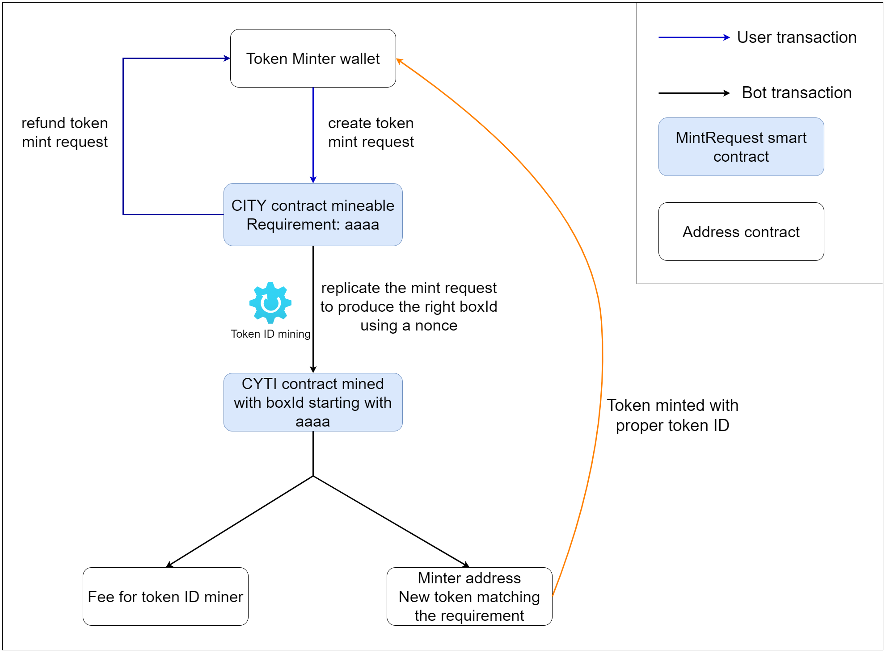

# Overview
The token minter create a CYTI contract that includes:
- the description of the token he wants to mint
- its address (to sent the tokens)
- a pattern for the start of the token ID (for example "aaaa" in the following diagram)
- an amount a of ERG to process the mining transactions and pay a fee to the miner processing them (min 0.042 ERG)

This CYTI contract is refundable to the minter until it does not meet the requirement for the boxId.

Miners (running the token ID mining software) can try to find the right hash for the output box.

Once a miner found it and send the transaction, the contract can be processed (by anyone, without signing) to mint the tokens for the token minter and pay the fee to the miner.

# Transactions details

# Ergoscript contract
https://github.com/ThierryM1212/cyti/blob/f04feba87cc46bcc9c9f748024e2cda7a2e7ee71/contract/cyti_mint_request.es#L1-L80

# Compile the contract
## Standard
java -cp ErgoScriptCompiler-assembly-0.1.jar Compile cyti_mint_request.es symbols.json

The ErgoScriptCompiler jar can be downloaded at: https://github.com/ergoplatform/ergoscript-compiler/releases/download/v0.1/ErgoScriptCompiler-assembly-0.1.jar

## Generate javascript constants - compile.py
With Python 3 installed:
python compile.py all symbols.json

