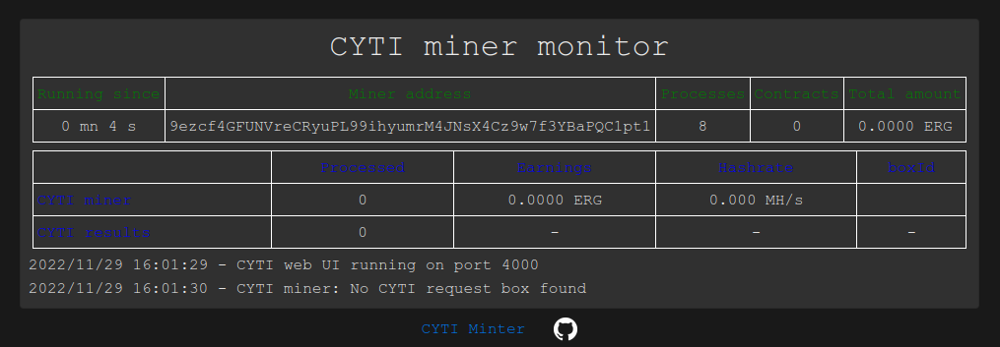
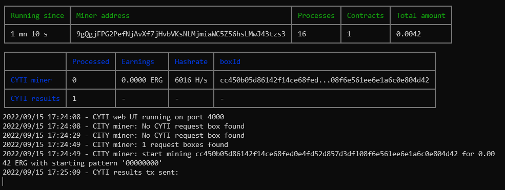

# CYTI mint bot
Bot mining tokenID for CYTI smart contract and processing the token minting and miner payment.

# Usage
## Configuration
config.js
|Configuration parameter|Comment                                           |
|-----------------------|--------------------------------------------------|
|MINER_ADDRESS          |Address to receive fee for mining token ID        |
|PARALLEL_DEGREE        | Number of worker processes                       |
|MINER_PORT             | port for the web monitoring UI (default 4000)    |
|MIN_ERG_PRICE_2_CHAR   | Minimal prices to mint token ID with 2 characters|
|MIN_ERG_PRICE_4_CHAR   | Minimal prices to mint token ID with 4 characters|
|MIN_ERG_PRICE_6_CHAR   | Minimal prices to mint token ID with 6 characters|
|MIN_ERG_PRICE_8_CHAR   | Minimal prices to mint token ID with 8 characters|
|MINER_COLD_DOWN        | Miner wait time when nothing to process (s)      |
|MINER_COLD_DOWN        | Interval to process CYTI results transactions (s)|
|EXPLORER_API_URL       | Ergo explorer URL                                |
|NUM_ITERATIONS         | Number of tries per process per try              |
|COLOR_HEADER_1         | Headers color for the first table                |
|COLOR_HEADER_2         | Headers color for the second table               |
|LOG_LENGTH             | Number of log line to display                    |
|DEBUG                  | Enable debug mode if > 0                         |

The configuration of any value can be overidden by an enviroment variable with the same name.
This allow to run the provided haileypdll/cyti-miner with your configuration (see "Run docker image")

## Windows - cyti-miner.exe
    Unzip the provided package.
    Double click the exe or execute it using cmd.

## Linux (x64) - cyti-miner
    untar the provided package.
    ```run: ./cyti-miner```

## cyti-miner.js (All platform)
### pre-requisites
    CYTI miner is tested and delivered with Nodejs 16.15.0
    It requires Nodejs >= 15 to run.

### install
    npm i

### Run
    node cyti-miner.js

## Build executable
    This requires to install nexe, python 3, NASM and Visual Studio (Windows) or build-essentials (linux)
    npm run buildexe

## Build docker image
    - Update the configuration file
    - docker run -p 4000:4000 cyti-miner

## Run haileypdll/cyti-miner docker image
    - docker pull haileypdll/cyti-miner:latest
    Provide the config parameter in the docker environment
    - docker run -e MINER_ADDRESS=9ezcf4GFUNVreCRyuPL99ihyumrM4JNsX4Cz9w7f3YBaPQC1pt1 -e PARALLEL_DEGREE=4 -p 4000:4000 haileypdll/cyti-miner:latest

# Overview
## Web UI


## Console UI

